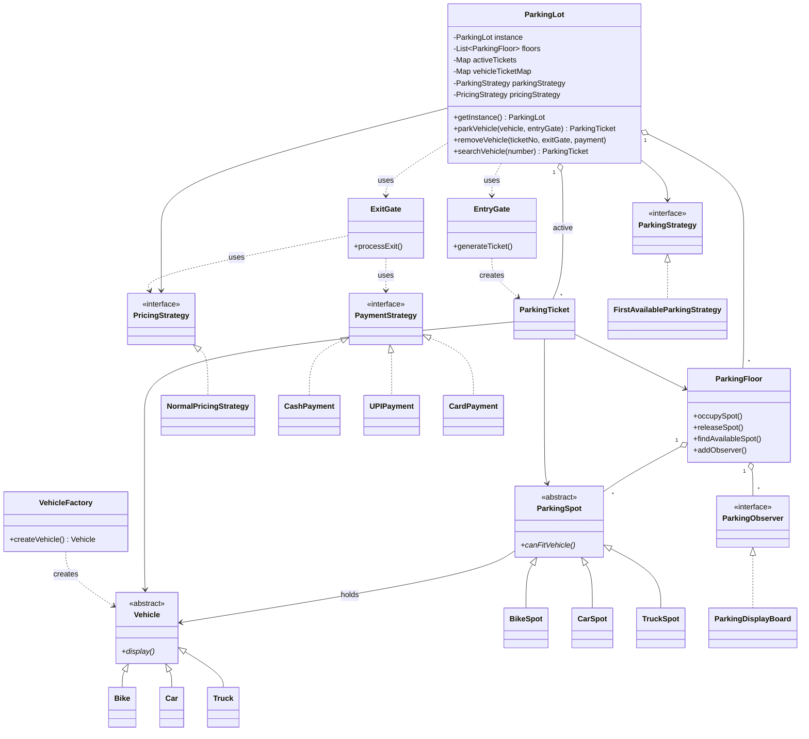

<div align="center">


# ParkEngine - Parking Lot Management System

**A console-based multi-floor parking system built with Java, OOP principles, Low-Level Design, and Design Patterns.**

<p>
  
  
  
  
</p>

<p>
  
  
</p>

</div>

---

## Overview

The **Parking Lot Management System** is a Java-based application designed using **Object-Oriented System Design**
principles and Design Patterns.

The project models a real-world parking facility where different types of vehicles can enter the parking lot, receive
appropriate parking spaces, generate parking tickets, calculate parking charges, and exit through designated gates.

The primary objective of this project is not only to implement parking functionality, but also to demonstrate how a
real-world problem can be converted into a **scalable, maintainable, modular, and extensible software architecture.**

The project focuses on applying **Object-Oriented Programming, SOLID principles, interfaces, abstraction, inheritance, polymorphism, and classic design patterns** to a real-world system.

---

## Features

- Multiple vehicle types: Bike, Car, and Truck
- Multiple parking floors
- Vehicle-specific parking spots
- Parking spot allocation using Strategy Pattern
- Vehicle creation using Factory Pattern
- Parking availability updates using Observer Pattern
- Central parking management using Singleton Pattern
- Parking ticket generation and tracking
- Vehicle search using vehicle number
- Duplicate vehicle parking prevention
- Parking fee calculation
- Cash, UPI, and Card payment methods
- Console-based CLI application

---

## Design Patterns Used

| Pattern       | Implementation                           | Purpose                                               |
| ------------- | ---------------------------------------- | ----------------------------------------------------- |
| **Singleton** | `ParkingLot`                             | Maintains a single parking lot instance               |
| **Factory**   | `VehicleFactory`                         | Creates vehicle objects based on vehicle type         |
| **Strategy**  | `ParkingStrategy`                        | Provides parking spot allocation algorithms           |
| **Strategy**  | `PricingStrategy`                        | Provides parking fee calculation algorithms           |
| **Strategy**  | `PaymentStrategy`                        | Supports different payment methods                    |
| **Observer**  | `ParkingObserver`, `ParkingDisplayBoard` | Updates parking availability when spot status changes |

---

# Architecture

---

## Class Diagram



---

---

# Project Structure

```text
Park-Engine/
│
├── README.md
├── .gitignore
├── assets/                                  # Project assets
│   └── banner.svg                          # GitHub README banner
│
└── src/
    │
    ├── factory/                             # Object creation
    │   └── VehicleFactory.java              # Creates vehicle objects
    │
    ├── gate/                                # Entry and exit operations
    │   ├── EntryGate.java                   # Handles vehicle entry and ticket generation
    │   └── ExitGate.java                    # Handles vehicle exit, pricing, and payment
    │
    ├── model/                               # Core domain objects
    │   ├── Vehicle.java                     # Abstract base class for vehicles
    │   ├── VehicleType.java                 # Enum for vehicle types
    │   ├── Bike.java                        # Represents a bike
    │   ├── Car.java                         # Represents a car
    │   ├── Truck.java                       # Represents a truck
    │   │
    │   ├── ParkingSpot.java                 # Abstract base class for parking spots
    │   ├── SpotType.java                    # Enum for parking spot types
    │   ├── BikeSpot.java                    # Parking spot for bikes
    │   ├── CarSpot.java                     # Parking spot for cars
    │   ├── TruckSpot.java                   # Parking spot for trucks
    │   │
    │   ├── ParkingFloor.java                # Manages spots and floor availability
    │   ├── ParkingTicket.java               # Stores parking ticket information
    │   └── TicketStatus.java                # Enum for ticket status
    │
    ├── observer/                            # Observer Pattern
    │   ├── ParkingObserver.java             # Interface for availability observers
    │   └── ParkingDisplayBoard.java         # Displays parking availability
    │
    ├── payment/                             # Payment and pricing
    │   ├── PaymentStrategy.java             # Interface for payment methods
    │   ├── CashPayment.java                 # Handles cash payments
    │   ├── UPIPayment.java                  # Handles UPI payments
    │   ├── CardPayment.java                 # Handles card payments
    │   ├── PricingStrategy.java             # Interface for pricing algorithms
    │   └── NormalPricingStrategy.java       # Calculates normal parking charges
    │
    ├── strategy/                            # Parking allocation strategies
    │   ├── ParkingStrategy.java             # Interface for parking allocation
    │   └── FirstAvailableParkingStrategy.java # Selects the first suitable parking spot
    │
    ├── ParkingLot.java                      # Central parking lot manager (Singleton)
    └── ParkEngine.java                      # CLI application entry point
```

---

# Getting Started

## Prerequisites

- JDK 8 or higher
- Git

Check the installed Java version:

```bash
java -version
javac -version
```

## Clone the Repository

```bash
git clone https://github.com/SanketHajare44/Park-Engine.git
cd Park-Engine
```

## Compile

From the project root:

### Linux / macOS

```bash
javac -d out $(find src -name "*.java")
```

### Windows PowerShell

```powershell
javac -d out (Get-ChildItem -Recurse -Filter *.java src | ForEach-Object FullName)
```

## Run

```bash
java -cp out ParkEngine
```

---

# Application Menu

```text
---------------------------------------------------
------------------- Park Engine -------------------
---------------------------------------------------

1 : Park Vehicle
2 : Exit Vehicle
3 : Search Vehicle
4 : Display Parking Lot
5 : Exit

---------------------------------------------------

Enter your choice :
```

---

# Example

## Park Vehicle

```text
Select vehicle type:
1 : Bike
2 : Car
3 : Truck

Enter vehicle Number:
MH12SH003
```

The system:

1. Creates the vehicle using `VehicleFactory`
2. Finds a suitable parking spot
3. Occupies the spot
4. Generates a parking ticket
5. Updates the display board

Example ticket:

```text
------------------ Parking Ticket ------------------

Ticket Number  : 1001
Vehicle Number : MH12SH003
Vehicle Type   : BIKE
Floor Number   : 1
Spot Number    : 101
Ticket Status  : ACTIVE
```

## Exit Vehicle

The user enters the ticket number and selects a payment method:

```text
1 : Cash
2 : UPI
3 : Card
```

The system:

1. Finds the active ticket
2. Calculates the parking duration
3. Calculates the parking charge
4. Processes the selected payment
5. Releases the parking spot
6. Updates the display board
7. Removes the ticket from active records

---

# Pricing

`NormalPricingStrategy` calculates parking charges based on the vehicle type and parking duration.

| Vehicle | Rate per Hour |
| ------- | ------------: |
| Bike    |        Rs. 20 |
| Car     |        Rs. 50 |
| Truck   |       Rs. 100 |

Partial parking hours are rounded up, with a minimum charge of one hour.

---

# Extending the System

The system is designed so that new behavior can be added through existing interfaces.

| Requirement                            | Implementation                                                   |
| -------------------------------------- | ---------------------------------------------------------------- |
| Add a new payment method               | Implement `PaymentStrategy`                                      |
| Add a new pricing rule                 | Implement `PricingStrategy`                                      |
| Add a new parking allocation algorithm | Implement `ParkingStrategy`                                      |
| Add a new availability observer        | Implement `ParkingObserver`                                      |
| Add a new vehicle type                 | Add a `Vehicle` implementation and update vehicle creation logic |

For example, a new payment method can be added by implementing:

```java
public class WalletPayment implements PaymentStrategy {

    @Override
    public void pay(double amount) {
        System.out.println("Wallet Payment Successful : Rs. " + amount);
    }
}
```

The existing `PaymentStrategy` contract remains unchanged.

---

# Roadmap

- [ ] Improve CLI input validation
- [ ] Add JUnit 5 unit tests
- [ ] Add persistent storage
- [ ] Add more parking allocation strategies
- [ ] Add dynamic / peak-hour pricing
- [ ] Add monthly parking passes
- [ ] Add concurrency support for multiple gates
- [ ] Add REST API using Spring Boot

These are future improvements and are not part of the current implementation.

---

# Code Commenting Style

Comments in the source code are kept short and focused on the responsibility of the class, interface, enum, or important logic block.

### Class

```java
// Manages the complete parking facility
public class ParkingLot {
}
```

### Interface

```java
// Defines the contract for parking allocation strategies
public interface ParkingStrategy {
}
```

### Enum

```java
// Defines the supported vehicle types
public enum VehicleType {
    BIKE,
    CAR,
    TRUCK
}
```

### Strategy Implementation

```java
// Selects the first suitable available parking spot
public class FirstAvailableParkingStrategy
        implements ParkingStrategy {
}
```

### Factory

```java
// Creates vehicle objects based on vehicle type
public class VehicleFactory {
}
```

### Observer

```java
// Displays parking availability for a floor
public class ParkingDisplayBoard
        implements ParkingObserver {
}
```

Comments should explain **purpose and responsibility**, not obvious Java syntax.

---

# Learning Outcomes

This project provided practical experience with:

- Java
- Object-Oriented Programming
- Low-Level Design
- UML
- SOLID principles
- Abstraction
- Encapsulation
- Inheritance
- Polymorphism
- Interfaces
- Design Patterns
- Separation of Responsibilities
- Loose Coupling
- Object Collaboration

---

# Future Scope

The current implementation is a console-based LLD project. It can be extended into a larger application by adding:

- Database persistence
- REST APIs
- Authentication and authorization
- Web or mobile interface
- Online parking reservation
- Real-time availability
- Payment gateway integration
- Administrative dashboard
- Vehicle number plate recognition
- Advanced parking allocation
- Concurrent vehicle entry and exit handling

---

# Contributing

This project is primarily maintained as a learning and portfolio project.

Suggestions and improvements are welcome.

For a contribution:

```bash
git checkout -b feature/your-feature
```

Make your changes and commit:

```bash
git add .
git commit -m "Add your feature"
```

Push the branch:

```bash
git push origin feature/your-feature
```

---

# Author

**Sanket Sadashiv Hajare**

B.E. Computer Engineering | Java | Software Engineering | System Design | LLD

[](https://github.com/SanketHajare44)

---

<div align="center">

**ParkEngine - Parking Lot Management System**

</div>
