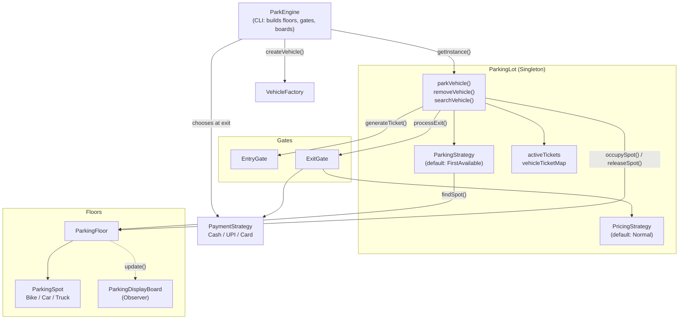
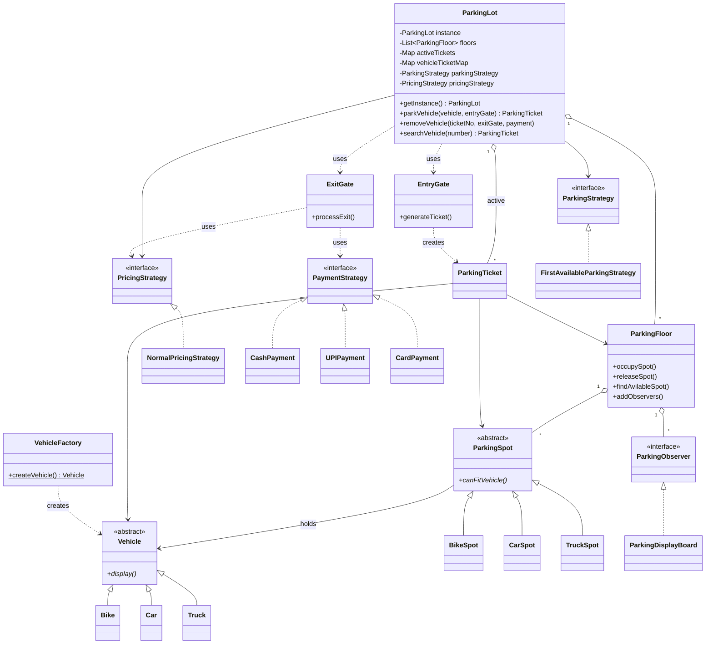
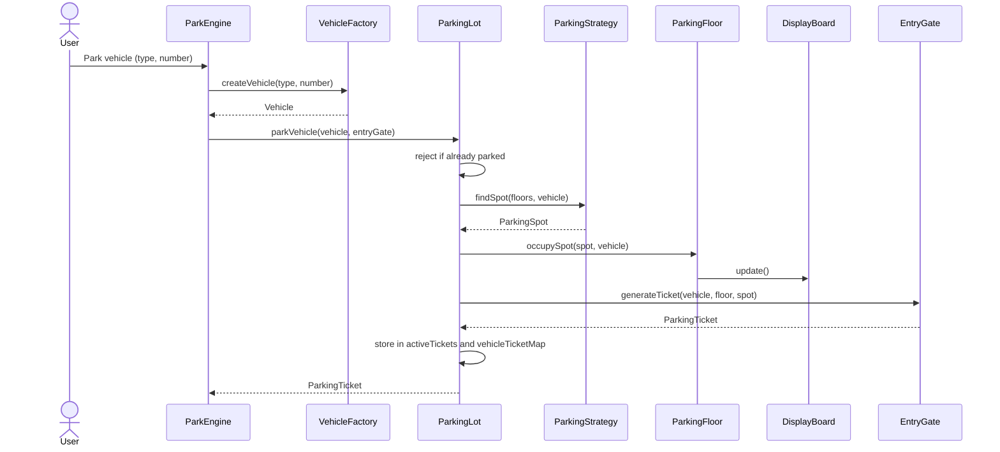
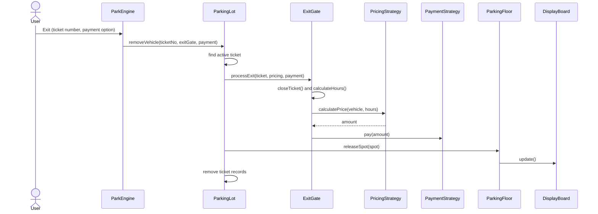

<div align="center">


# ParkEngine – Scalable Parking Allocation System

**A clean, extensible, console-based multi-floor parking system built with Java, OOP principles, and classic design patterns.**

<p>
  
  
  
  
</p>

<p>
  
  
  
  
</p>

[Overview](#-overview) •
[Features](#-features) •
[Design Patterns](#-design-patterns-used) •
[Architecture](#-architecture) •
[Project Structure](#-project-structure) •
[Getting Started](#-getting-started) •
[Pricing](#-pricing) •
[Extending](#-extending-the-system) •
[Author](#-author)

</div>

---

## 📖 Overview

**ParkEngine** is a low-level-design (LLD) implementation of a multi-floor parking lot. It handles vehicle entry, spot allocation, ticket generation, fee calculation, and payment. Each concern sits behind its own class or interface, so new behavior can be added without modifying existing code.

The project demonstrates **system design thinking**, **object-oriented programming**, and the **SOLID principles** applied through well-known **design patterns**.

## ✨ Features

- 🚗 **Multiple vehicle types**: Bike, Car, and Truck, each with a dedicated spot type
- 🏢 **Multi-floor parking**: every floor manages its own spots and availability
- 🎟️ **Ticket lifecycle**: a ticket is issued at entry (`ACTIVE`) and closed at exit (`CLOSED`)
- 🔍 **Search by vehicle number**: look up the active ticket of any parked vehicle
- 🚫 **Duplicate protection**: the same vehicle cannot be parked twice
- 💰 **Pluggable pricing**: hourly billing, rounded up, with a minimum of 1 hour
- 💳 **Multiple payment methods**: Cash, UPI, and Card, chosen at exit
- 📍 **Pluggable allocation**: spot selection is a strategy (default: first available)
- 📺 **Live display boards**: per-floor availability refreshes on every park and exit
- 🧩 **Extensible**: new vehicles, pricing rules, payments, and allocation strategies need minimal change

## 🧠 Design Patterns Used

| Pattern       | Where                                                   | Why                                                                                 |
| ------------- | ------------------------------------------------------- | ----------------------------------------------------------------------------------- |
| **Singleton** | `ParkingLot`                                            | One central parking lot with a lazy, `synchronized` `getInstance()`                 |
| **Factory**   | `VehicleFactory`                                        | Creates `Bike`, `Car`, or `Truck` from a `VehicleType`, hiding the concrete classes |
| **Strategy**  | `ParkingStrategy`, `PricingStrategy`, `PaymentStrategy` | Interchangeable algorithms for spot allocation, pricing, and payment                |
| **Observer**  | `ParkingObserver`, `ParkingDisplayBoard`                | `ParkingFloor` notifies display boards whenever a spot is occupied or released      |

### OOP & SOLID in practice

- **Abstraction**: `Vehicle` and `ParkingSpot` are abstract base classes
- **Inheritance**: `Bike`, `Car`, `Truck` extend `Vehicle`; `BikeSpot`, `CarSpot`, `TruckSpot` extend `ParkingSpot`
- **Polymorphism**: `canFitVehicle()` and `display()` are overridden per subtype; strategies are used through their interfaces
- **Encapsulation**: private state with getters, and spot occupancy changes only through `parkVehicle()` and `removeVehicle()`
- **Single Responsibility**: gates, pricing, payment, allocation, and display each live in their own class
- **Open/Closed**: add a payment method, pricing rule, or allocation strategy by adding a class
- **Dependency Inversion**: `ParkingLot` and `ExitGate` depend on `ParkingStrategy`, `PricingStrategy`, and `PaymentStrategy` interfaces

## 🏗️ Architecture

### Component view

`ParkEngine` wires everything together and talks only to the `ParkingLot` singleton. `ParkingLot` coordinates the floors, gates, and strategies.



### Class diagram



### Park a vehicle



### Exit a vehicle



## 📁 Project Structure

```text
Park-Engine/
│
├── README.md
├── .gitignore
├── assets/
│   └── banner.svg
│
└── src/
    │
    ├── factory/                               # Object creation
    │   └── VehicleFactory.java                # Creates vehicle objects
    │
    ├── gate/                                  # Entry and exit operations
    │   ├── EntryGate.java                     # Handles vehicle entry and ticket generation
    │   └── ExitGate.java                      # Handles vehicle exit, pricing, and payment
    │
    ├── model/                                 # Core domain objects
    │   ├── Vehicle.java                       # Abstract base class for vehicles
    │   ├── VehicleType.java                   # Enum for vehicle types
    │   ├── Bike.java                          # Represents a bike
    │   ├── Car.java                           # Represents a car
    │   ├── Truck.java                         # Represents a truck
    │   │
    │   ├── ParkingSpot.java                   # Abstract base class for parking spots
    │   ├── SpotType.java                      # Enum for parking spot types
    │   ├── BikeSpot.java                      # Parking spot for bikes
    │   ├── CarSpot.java                       # Parking spot for cars
    │   ├── TruckSpot.java                     # Parking spot for trucks
    │   │
    │   ├── ParkingFloor.java                  # Manages spots and floor availability
    │   ├── ParkingTicket.java                 # Stores parking ticket information
    │   └── TicketStatus.java                  # Enum for ticket status
    │
    ├── observer/                              # Observer pattern
    │   ├── ParkingObserver.java               # Interface for availability observers
    │   └── ParkingDisplayBoard.java           # Displays parking availability
    │
    ├── payment/                               # Payment and pricing
    │   ├── PaymentStrategy.java               # Interface for payment methods
    │   ├── CashPayment.java                   # Handles cash payments
    │   ├── UPIPayment.java                    # Handles UPI payments
    │   ├── CardPayment.java                   # Handles card payments
    │   ├── PricingStrategy.java               # Interface for pricing algorithms
    │   └── NormalPricingStrategy.java         # Calculates normal parking charges
    │
    ├── strategy/                              # Parking allocation strategies
    │   ├── ParkingStrategy.java               # Interface for parking allocation
    │   └── FirstAvailableParkingStrategy.java # Selects the first suitable parking spot
    │
    ├── ParkingLot.java                        # Central parking lot manager (Singleton)
    └── ParkEngine.java                        # CLI application entry point
```

## 🚀 Getting Started

### Prerequisites

- **JDK 8** or higher
- Git

### Clone

```bash
git clone https://github.com/SanketHajare44/Park-Engine.git
cd Park-Engine
```

### Compile

```bash
# Linux / macOS
javac -d out $(find src -name "*.java")

# Windows (PowerShell)
javac -d out (Get-ChildItem -Recurse -Filter *.java src | ForEach-Object FullName)
```

### Run

```bash
java -cp out ParkEngine
```

### Demo setup

The CLI starts with a ready-to-use lot of **2 floors**, each with **2 bike, 2 car, and 2 truck spots** (spots `101–106` on floor 1 and `201–206` on floor 2), one entry gate, and one exit gate.

### Menu

```text
1 : Park Vehicle
2 : Exit Vehicle
3 : Search Vehicle
4 : Display Parking Lot
5 : Exit
```

### Sample output

```text
------------------ Display Board ------------------
Floor                : 1
Available Bike pots  : 2
Available Car pots   : 1
Available Truck pots : 2
---------------------------------------------------

Vehicle entering from gate : 1
------------------ Parking Ticket ------------------
Ticket Number  : 1001
Vehicle Number : MH12AB1234
Vehicle Type   : CAR
Floor Number   : 1
Spot Number    : 103
Ticket Status  : ACTIVE

Vehicle Exit from gate : 1
Parking duration       : 1
Parking charges        : 50.0
UPI Payment Successful : Rs. 50.0
```

## 💰 Pricing

`NormalPricingStrategy` bills per hour. Partial hours are rounded up, and the minimum charge is 1 hour.

| Vehicle | Rate per hour |
| ------- | ------------- |
| Bike    | Rs. 20        |
| Car     | Rs. 50        |
| Truck   | Rs. 100       |

## 🔧 Extending the System

| I want to add...                           | What to do                                                                                                                               |
| ------------------------------------------ | ---------------------------------------------------------------------------------------------------------------------------------------- |
| A new vehicle (e.g. EV)                    | Add a class extending `Vehicle`, a `VehicleType` and `SpotType` entry, a matching `ParkingSpot` subclass, and a case in `VehicleFactory` |
| A new payment method                       | Implement `PaymentStrategy`                                                                                                              |
| Peak-hour or weekend pricing               | Implement `PricingStrategy` and call `parkingLot.setPricingStrategy(...)`                                                                |
| Nearest-to-exit or lowest-floor allocation | Implement `ParkingStrategy` and call `parkingLot.setParkingStrategy(...)`                                                                |
| SMS or mobile notifications                | Implement `ParkingObserver` and register it with `floor.addObservers(...)`                                                               |

## 🗺️ Roadmap

- [ ] Input validation in the CLI menu (non-numeric input currently ends the program)
- [ ] Thread-safe allocation for concurrent gates (thread-safe collections, atomic ticket counter)
- [ ] Persistent storage for tickets
- [ ] Unit tests with JUnit 5
- [ ] More strategies: nearest spot, peak-hour pricing, monthly pass
- [ ] REST API layer (Spring Boot)

## 🤝 Contributing

Contributions, issues, and feature requests are welcome.

1. Fork the repository
2. Create a feature branch: `git checkout -b feature/your-feature`
3. Commit your changes: `git commit -m "Add your feature"`
4. Push the branch: `git push origin feature/your-feature`
5. Open a Pull Request

## 👨‍💻 Author

**Sanket Sadashiv Hajare**
B.E. Computer/IT · SPPU

[](https://github.com/SanketHajare44)

---

<div align="center">

If you found this project useful, consider giving it a ⭐

</div>
